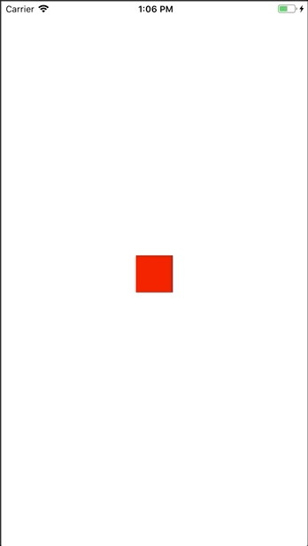
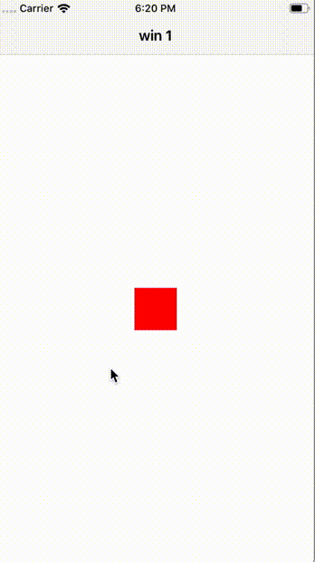
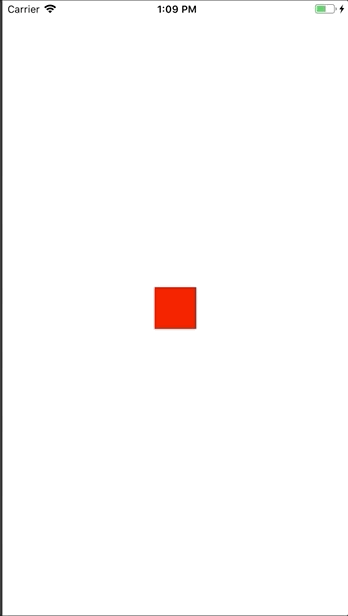
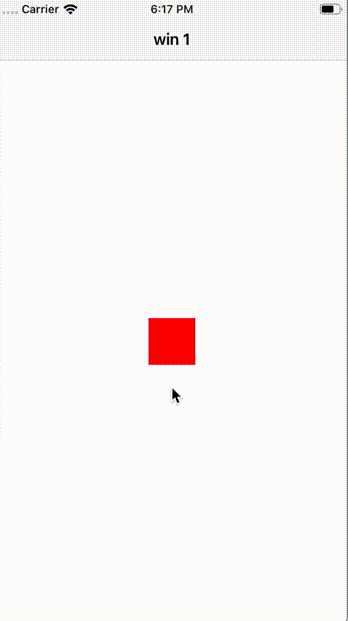

# Ti.Hero

PoC of Titanium swift Module support. https://github.com/HeroTransitions/Hero

Currently it extend TiViewProxy and TiWindowProxy to support `hero.id` and `hero.isEnabled`.

If using `NavigationWindow` set `hero.enabled` for current window before open new.
```js
currentWin.hero = { enabled:true };
nav.openWindow(newWin);
```

# Current state
works with all windows


## With Hero
 

## Without Hero
  
